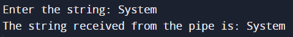

# OS-EX.6-IMPLEMENTATION-OF-INTER-PROCESS-COMMUNICATION-USING-PIPE

## AIM:
To write a program to illustrate IPC using pipes mechanisms.
## ALGORITHM:

1.    Start the process.
2.    Create a pipe.
3.    Fork the process.
4.    If the process is child process, then close the read end of the pipe and write the string to the pipe.
5.    If the process is parent process, then close the write end of the pipe and read the string from the pipe.
6.    Stop the process.
## PROGRAM:
```
#include <stdio.h>
#include <stdlib.h>
#include <string.h>
#include <sys/types.h>
#include <sys/wait.h>
#include <unistd.h>

int main() {
    int fd[2], child;
    char a[10];

    printf("Enter the string: ");
    scanf("%s", a);

    // Create a pipe
    pipe(fd);

    child = fork();

    if (child == 0) {
        // Child process
        close(fd[0]);
        write(fd[1], a, 5);
        wait(0);
    } else {
        // Parent process
        close(fd[1]);
        read(fd[0], a, 5);
        printf("The string received from the pipe is: %s\n", a);
    }

    return 0;
}
```

## OUTPUT:


## RESULT:
Thus the program for implementing inter process communication using pipe was written and the output was verified.
